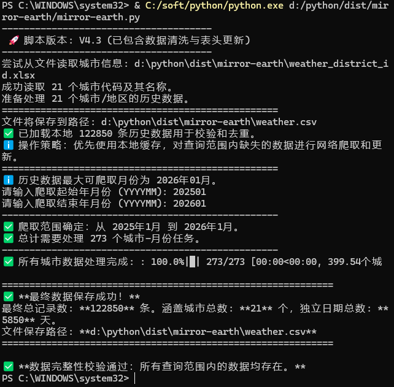

# python-weather
使用python拉取mirror-earth.com的天气数据 , 生成CSV数据

 

使用方法:

把"mirror-earth.py" , "weather_district_id.xlsx" 放在任意路径下运行
如果提示报错 , 根据报错内容 , 自行安装好脚本所需的依赖
运行后 , 根据提示 , 输入起始和截止的年月 (202501这样的格式)
之后会自动检测本地已有的数据 , 自动拉取缺失的日期对应的城市天气数据 , 自动保存在目录下的 "weather.csv" 文件里 .

    自定义拉取数据的城市:
    打开"weather_district_id.xlsx" 这个文件 , 在zzw这个sheet , 自行添加或修改城市和对应的城市编码这两列 .
    城市编码信息放在 "weather_district_id"这个sheet里 . 可以自行使用查询函数或者手动复制粘贴 , 形成两列即可 .

